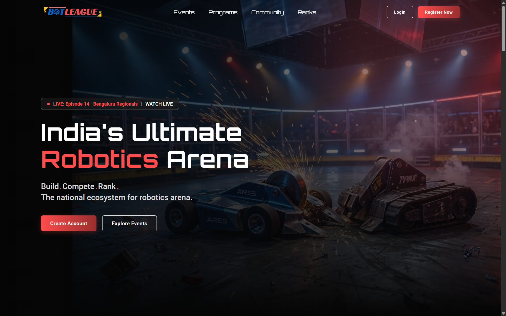
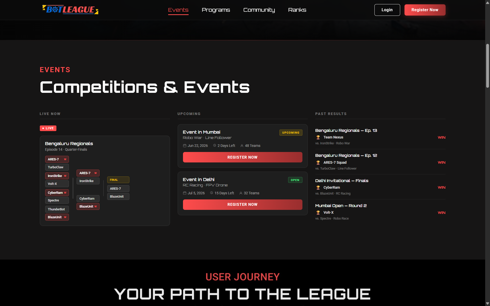

# BotLeagues Website Assignment

A responsive and modern landing page built with HTML, CSS, and JavaScript, showcasing BotLeagues events, programs, community, and rankings. Designed with a clean UI, smooth navigation, interactive elements, and a mobile-friendly experience.

## Features

- Responsive design for all screen sizes
- Smooth scrolling navigation
- Interactive UI components
- Modern and clean layout
- Active navbar section highlighting
- Optimized performance

## Technologies Used

- HTML5
- CSS3
- JavaScript (Vanilla JS)

## Screenshots

### Homepage


### Events Section


### Programs Section


### Community Section


## Project Structure

```text
BotLeagues/
│
├── index.html
├── style.css
├── script.js
├── images/
│   ├── homepage.png
│   ├── events.png
│   ├── programs.png
│   └── community.png
└── README.md
```

## Getting Started

1. Clone the repository

```bash
git clone <repository-url>
```

2. Open the project folder

```bash
cd BotLeagues
```

3. Open `index.html` in your browser.

## Author

Developed as part of the BotLeagues Frontend Assignment.